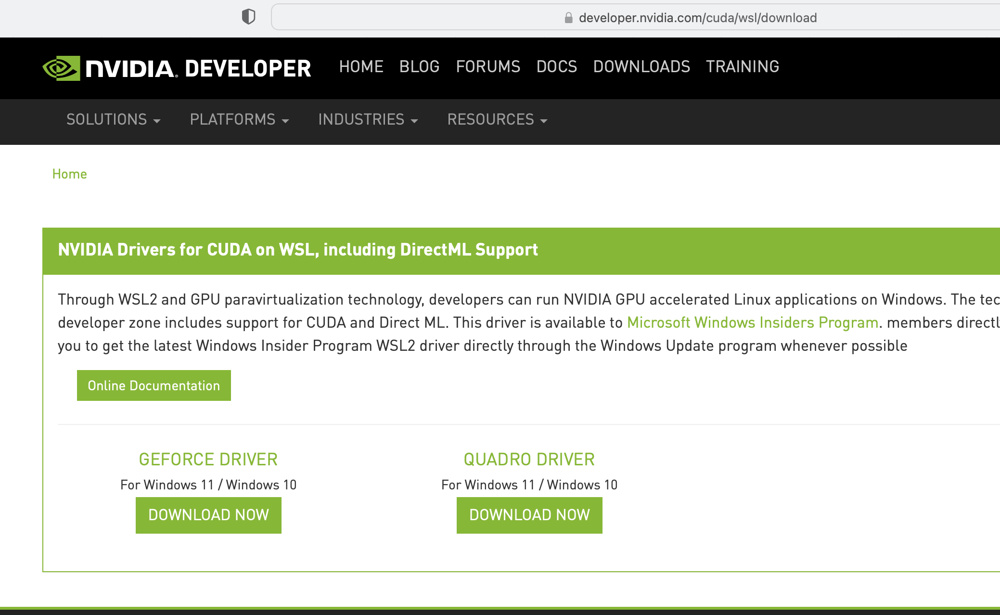
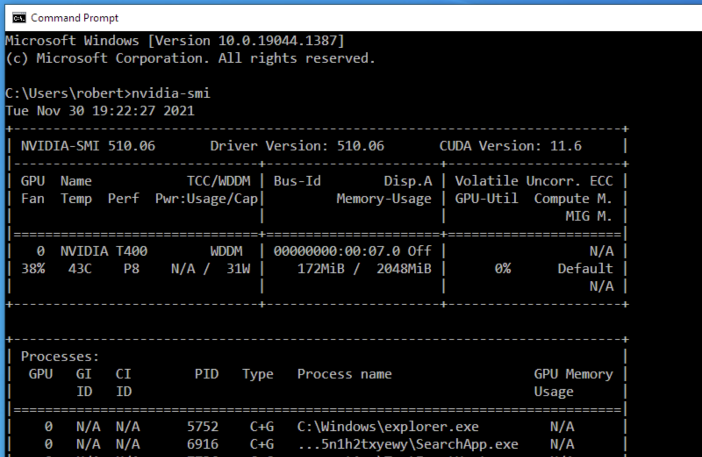
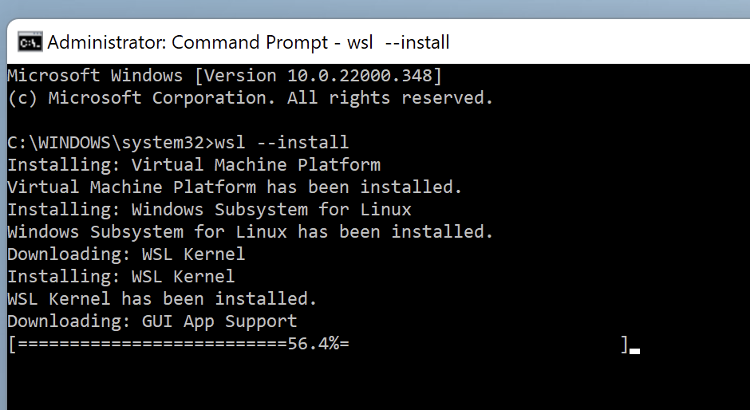
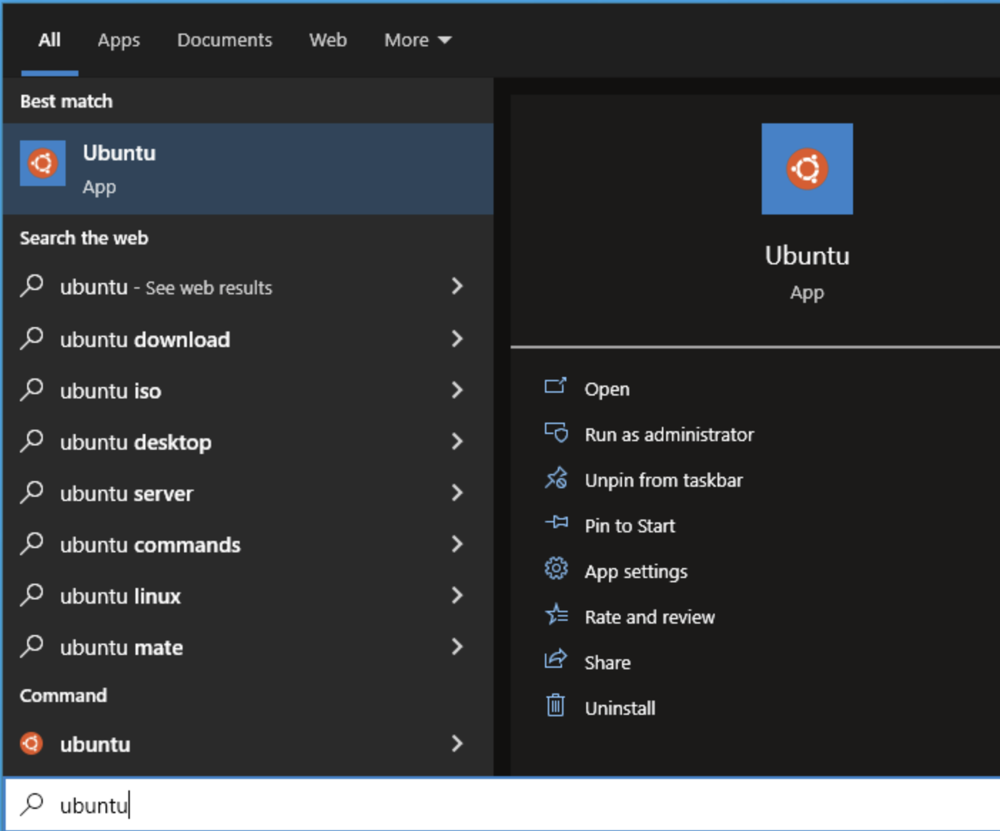
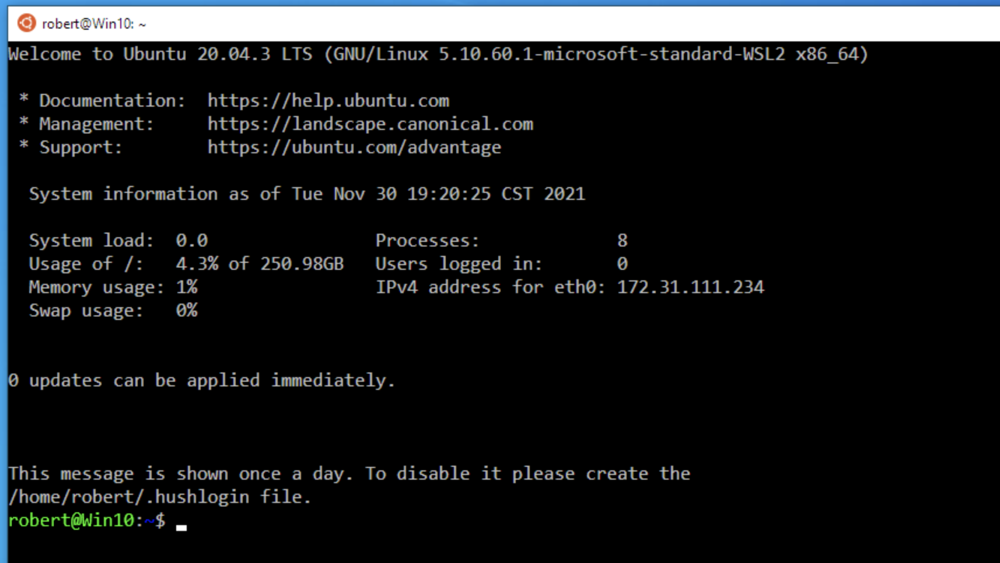
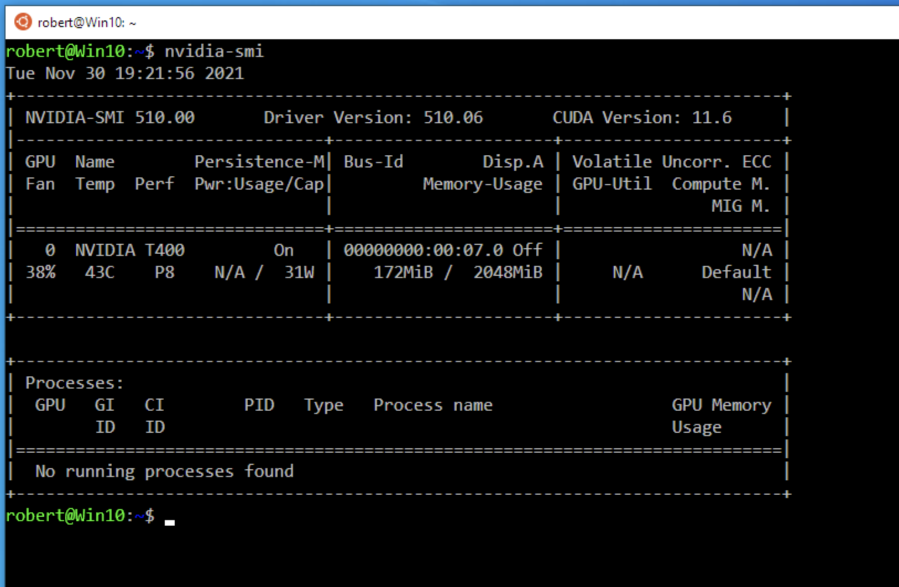
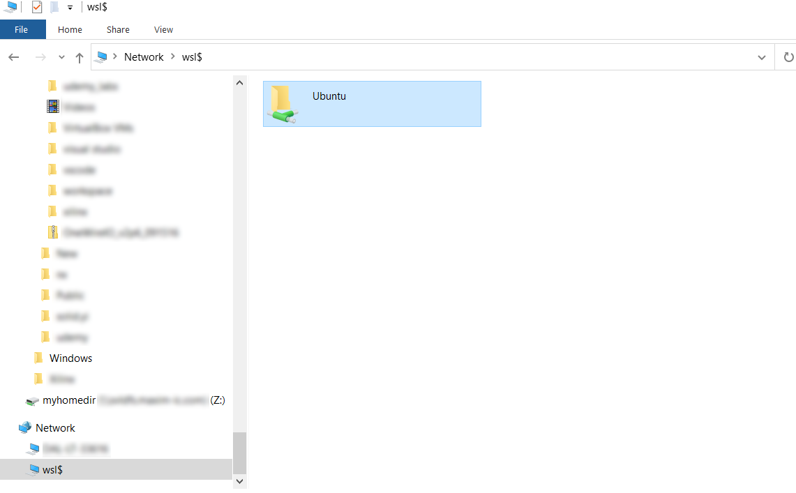
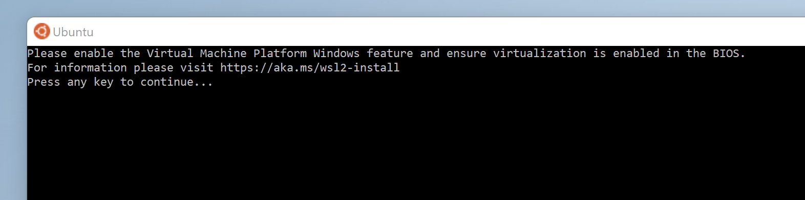

# Windows Subsystem for Linux (WSL2)

December 9, 2021

Windows Subsystem for Linux 2 allows model training under Ubuntu Linux with CUDA hardware acceleration, with full compatibility to the vast number of machine learning tools that are primarily developed on Linux.

## Requirements

### Drive Space

Ensure there is enough free space for the WSL2 installation and the MAX78000/MAX78002 tools, and datasets. A minimum of 32 GB free space is strongly recommended, but requirements vary with the size of the datasets used.

### Windows Version

New versions of Windows (Windows 10 **21H2** or newer, and Windows 11) support WSL2, the Windows Subsystem for Windows, *with* CUDA hardware acceleration.

* WSL2 requires virtualization features and a 64-bit machine.

In the start menu, type `About` to determine your Windows version and edition, and whether Windows is running in 64-bit mode.


For more information, see <https://aka.ms/wsl2-install>.


## CUDA Drivers

For certain graphics card models, Nvidia offers drivers that allow CUDA hardware acceleration inside WSL2. Install the latest drivers from <https://developer.nvidia.com/cuda/wsl/>:



After installing the drivers, ensure CUDA is available to Windows. Open a command prompt and run `nvidia-smi`.




## WSL2 Installation

Open a command prompt **with Administrator privileges** and install WSL2:

```shell
C:\> wsl --install
```



Then reboot.


## Using Ubuntu on Windows

Start or click on the “Ubuntu” icon and open it.




A Linux shell will open. At first run, assign a user name and password:


This will only be asked once. Opening “Ubuntu” again will skip this step.



Ensure CUDA is available inside WSL2 by running `nvidia-smi`.  




## File Sharing with Windows

The WSL2 file system should be used for all actions such as creating git repositories. Operating directly on the Windows file system can cause issues.

* To access Windows files *from within WSL2,* use `/mnt/c/`, for example `/mnt/c/Users/<name>/Documents/`.

* While WSL2 is running, the WSL2 file system can be accessed *from Windows* using the network path `\\wsl$\Ubuntu`, for example using Windows Explorer. This path can also be mapped as a network drive.
  *Note: If Ubuntu 20.04 was installed from the Windows store, the network path might instead be* `\\wsl$\Ubuntu-20.04`.



The user home is typically at `\\wsl$\Ubuntu\home\<name>\`.

*Please note that the MSDK MinGW shell creates a user directory at* `C:\MaximSDK\Tools\MinGW\msys\1.0\home\<name>\`. *This directory is separate from both the Windows documents and the WSL2 home directory.*


## Troubleshooting

### Graphics Card (CUDA) Memory Use

Windows Display Manager will use a portion of the graphics card (CUDA) memory for its display manager, subtracting from the memory available for model training. The amount of used memory is proportional to the screen resolution, and other factors. This can only be prevented when there is a second graphics card present in the system that also offers hardware acceleration. This card must be selected using the Nvidia control panel (Manage 3D Settings – Preferred Graphics Processor).

*Note: Reduce the training batch size to reduce model training memory requirements.*

### Resource Reporting

Running `nvidia-smi` inside WSL2 may not in all cases accurately display the total GPU resource usage. Run `nvidia-smi` from a Windows command prompt instead.

### Lack of Virtualization Features

If virtualization is disabled, the system will display an error message. For troubleshooting, please go to <https://aka.ms/wsl2-install>.


