# Neural Network Training on Windows

December 8, 2022

The preferred and most compatible way to train networks is using the *[Windows Subsystem for Linux (WSL2)](https://github.com/MaximIntegratedAI/ai8x-synthesis/blob/develop/docs/WSL2.md).* However, WSL2 is not always available. The instructions in this document demonstrate how to train networks natively on Windows, without WSL2.

## Requirements

### 64-bit Windows

Windows **must** run in 64-bit mode. To check, use the Start menu and type “About”.

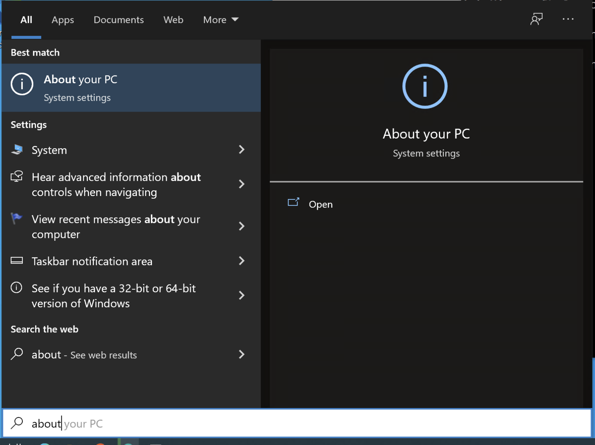

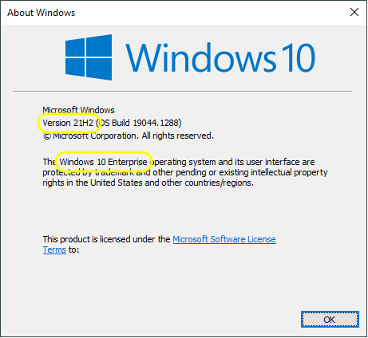

### Packages

Several applications and packages are needed. Some of the installation steps may require administrator privileges.

#### Analog Devices MSDK

Install the [Analog Devices MSDK](https://www.analog.com/en/design-center/evaluation-hardware-and-software/software/software-download?swpart=SFW0010820A) for MAX78000/MAX78002.

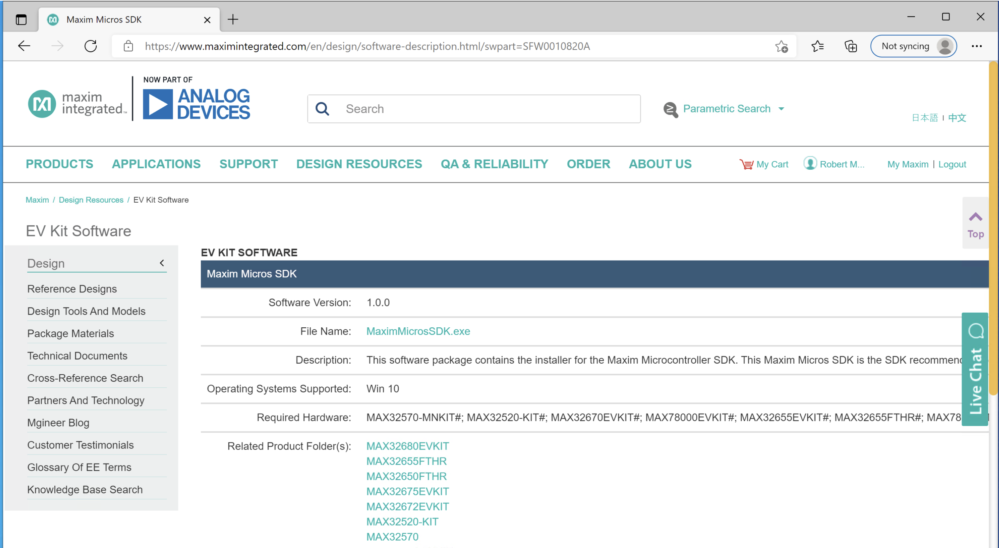

#### Python

Install the latest available version of Python 3.8 from [python.org](https://python.org/downloads/windows/). As of late 2021, the latest available 3.8 version with a Windows installer was 3.8.10.

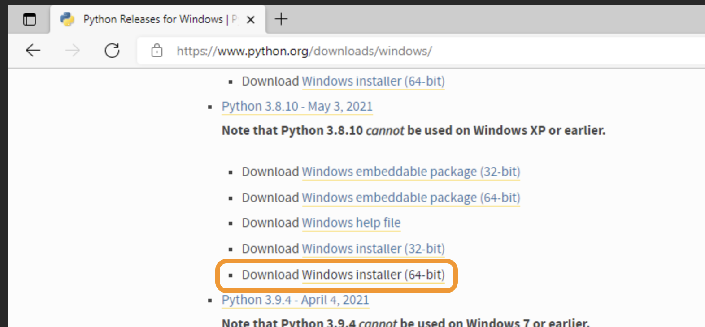

Run the installer, and add Python to the Path:

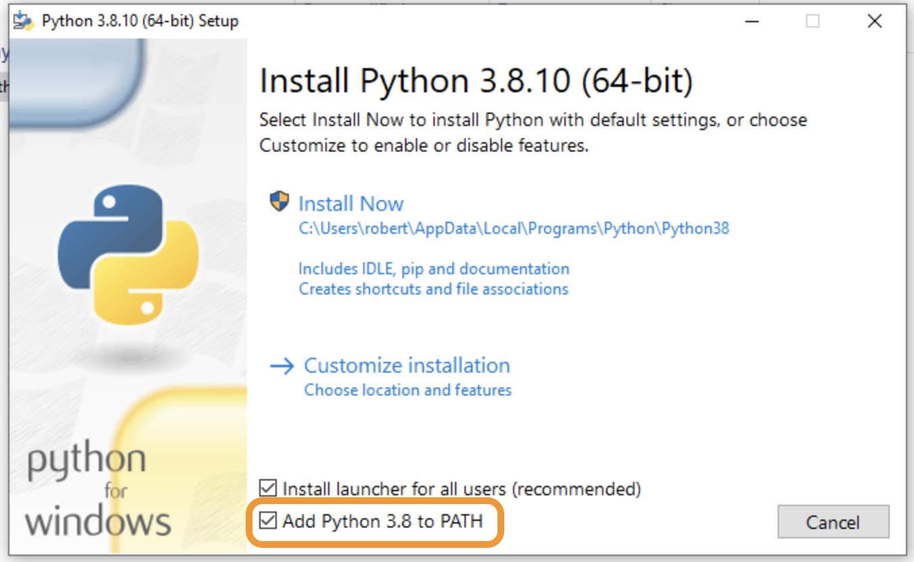

Allow the installer to disable the PATH length limit.

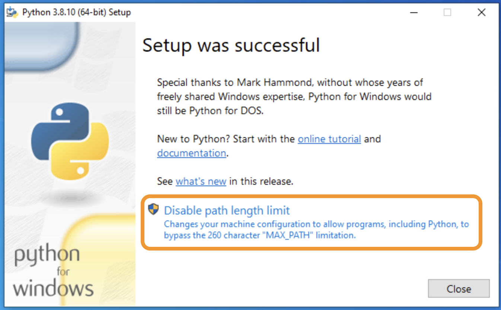

#### git

A git binary is required. Download git from [gitforwindows.org](https://gitforwindows.org/) or [git-scm.com](https://git-scm.com/download/win).

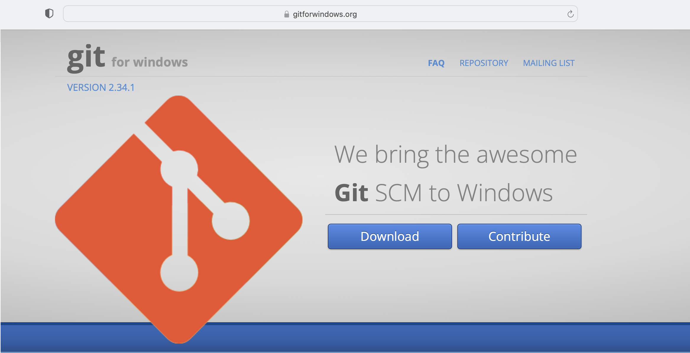
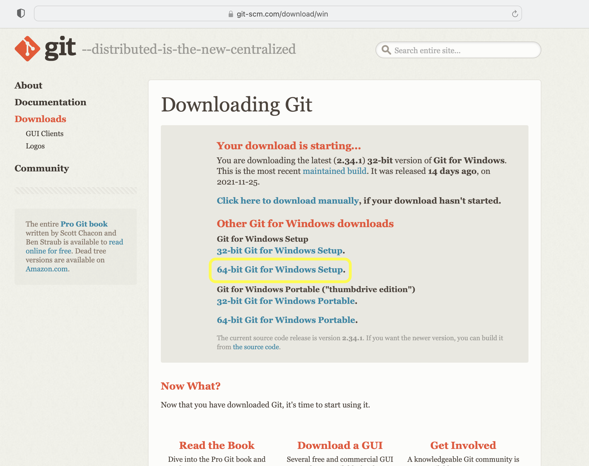

During setup, there are options can be selected for line endings and system settings. The following settings are recommended:

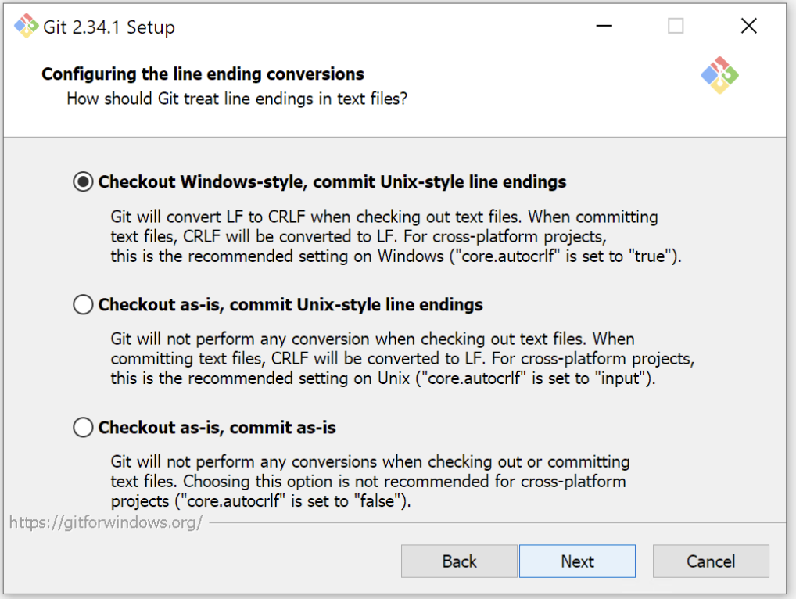

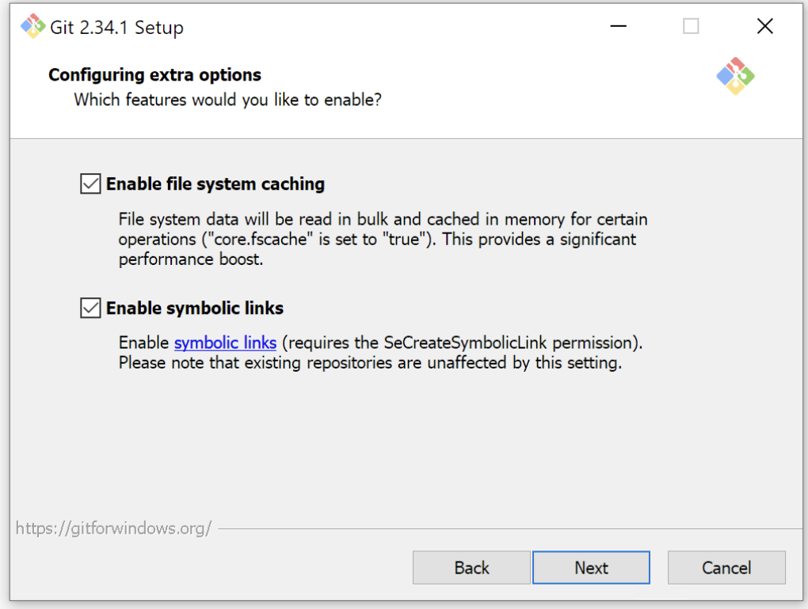


##### GIT_PYTHON_GIT_EXECUTABLE Environment Variable

Next, add a new environment variable that points to the location of git.exe. In the Start menu, type “environment” and open the Control panel. Under “System Properties” - “Advanced”, click “Environment Variables…” and add a “New User Variable” with the variable name `GIT_PYTHON_GIT_EXECUTABLE` and the “mapped” location of git.exe. This value is typically `/c/Program Files/Git/cmd/git.exe` as shown in the screen shot below.

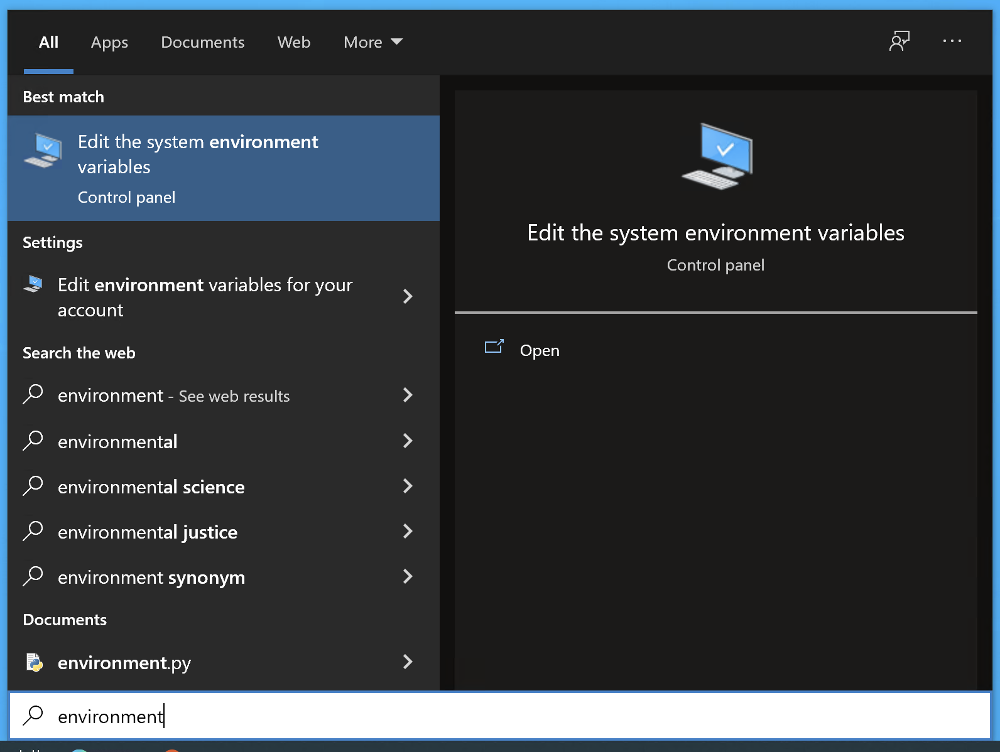

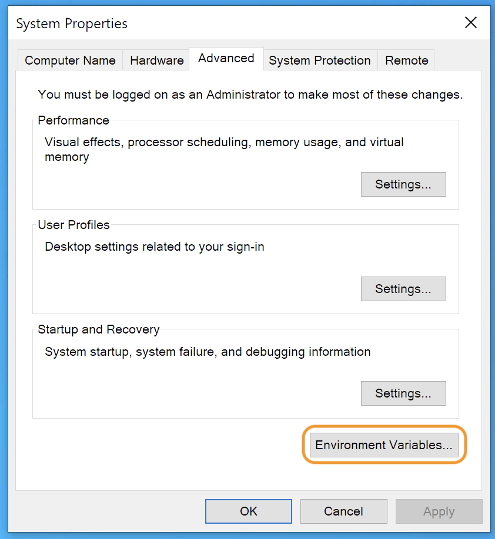

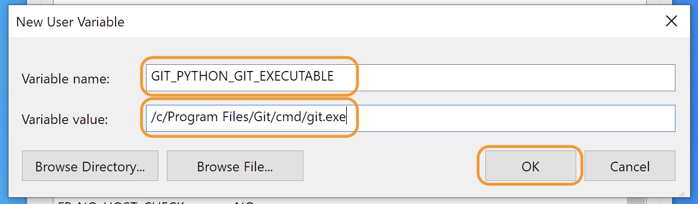

It is also possible that if git was installed for just the local user (usually when installed without admin rights), git may be in the user’s `AppData` folder instead of `Program Files`:

    C:\Users\<username>\AppData\Local\Programs\Git\cmd

By default, Windows hides folders such as the user’s AppData folder as “hidden items”. In order to view these files, hidden items need to be [enabled in the File Explorer](https://support.microsoft.com/en-us/windows/view-hidden-files-and-folders-in-windows-97fbc472-c603-9d90-91d0-1166d1d9f4b5).

If git was installed in the `AppData` folder, the environment variable should look as follows:


## MAX78000 Training and Synthesis Repositories

The next step is to clone the ai8x-training and ai8x-synthesis repositories.

Open a MinGW shell using Start - Maxim Integrated SDK - MinGW:

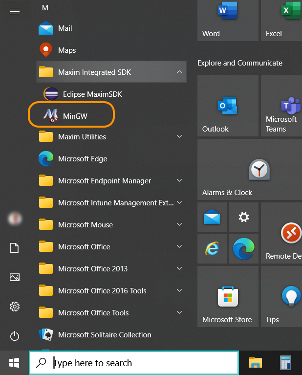

Next, change to the target directory (the default is  `C:\MaximSDK\Tools\MinGW\msys\1.0\home\<name>\`).

Check out the training and synthesis repositories as detailed in the [main documentation](https://github.com/MaximIntegratedAI/ai8x-synthesis/blob/develop/README.md#upstream-code).


## Troubleshooting

### Could not Install Packages due to an OSError

When `pip3 install -U pip setuptools wheel` returns that it could not uninstall pip3.exe, simply ignore the error and repeat the command one more time.

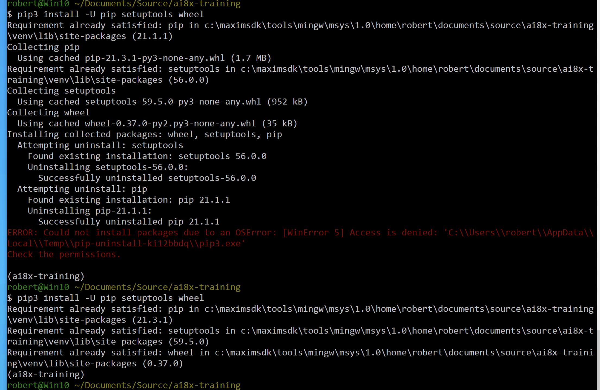

### CUDNN_STATUS_INTERNAL_ERROR

On Windows, it may be necessary to limit the number of PyTorch workers to 1 to avoid crashes or internal errors such as `CUDNN_STATUS_INTERNAL_ERROR` in the training software.

Add `--workers=1` when running any training script, for example;

```shell
$ scripts/train_mnist.sh --workers=1
```

### Git Executable Error

When running `ai8xize.py` , the software may display an error regarding `GIT_PYTHON_GIT_EXECUTABLE` as shown below. Please set the `GIT_PYTHON_GIT_EXECUTABLE` environment variable as shown [above](#GIT_PYTHON_GIT_EXECUTABLE Environment Variable).

As an alternative, run the following before calling `ai8xize.py`:

```shell
$ source scripts/set-git
```


*Error message:*

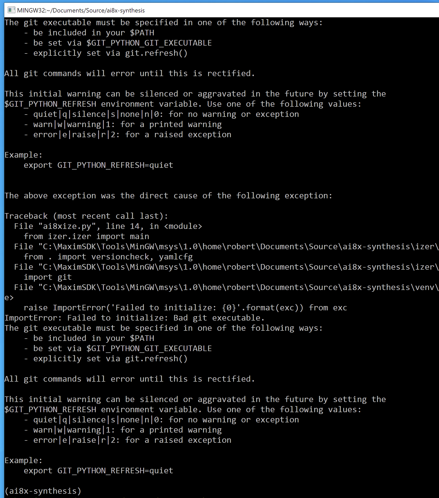
